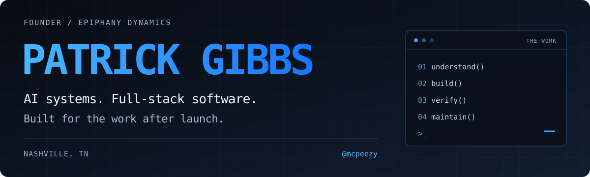

  

  <strong>AI Systems Engineering &nbsp;·&nbsp; Full-Stack Development &nbsp;·&nbsp; Business Automation</strong>

  <a href="https://epiphanydynamics.ai"><strong>Epiphany Dynamics</strong></a> &nbsp;/&nbsp;
  <a href="https://github.com/epiphany-dynamics"><strong>Public repositories</strong></a> &nbsp;/&nbsp;
  <a href="https://book.epiphanydynamics.ai"><strong>Work with me</strong></a> &nbsp;/&nbsp;
  <a href="mailto:patrick@epiphanydynamics.ai"><strong>Email</strong></a>

---

I'm **Patrick Gibbs**, founder of **[Epiphany Dynamics](https://epiphanydynamics.ai)** in Nashville, Tennessee. I build AI agents, voice workflows, web applications, and the integrations around them for businesses that need the system to keep working after launch.

My focus is the complete workflow: the interface people use, the data it depends on, the actions it takes, and what happens when something fails.

> **Most of my development lives in [@epiphany-dynamics](https://github.com/epiphany-dynamics).** This profile connects you to that work. Client implementations stay private; the public repositories showcase tools, products, and reusable engineering patterns.

## Selected engineering work

<table>
<tr>
<td width="50%" valign="top">
<h3><a href="https://github.com/epiphany-dynamics/prime-desktop">Prime Desktop</a></h3>

<strong>A desktop interface that doesn't own the agent's lifetime.</strong>

Early public macOS client for Prime Agent: split-pane chats, live worker attachment, project context, and an agents dashboard. Close the interface without terminating background agents; reopen and reattach.

<code>JavaScript</code> <code>Electron</code> <code>RPC</code>

Engineering focus: process lifecycle, sandboxed rendering, narrow IPC, and smoke-test tooling.

<a href="https://github.com/epiphany-dynamics/prime-desktop/blob/main/DAEMON-ATTACHMENT.md">Architecture</a> · <a href="https://github.com/epiphany-dynamics/prime-desktop/releases">Releases</a> · <a href="https://github.com/epiphany-dynamics/prime-desktop/blob/main/docs/KNOWN_LIMITS.md">Known limits</a>

</td>
<td width="50%" valign="top">
<h3><a href="https://github.com/epiphany-dynamics/resilient-data-source-kit">Resilient Data Source Kit</a></h3>

<strong>External data is unreliable. The pipeline shouldn't pretend otherwise.</strong>

Reference implementations for backoff with jitter, circuit breaking, block detection, and multi-signal entity matching. Confidence bands preserve uncertainty instead of turning missing data into false conclusions.

<code>TypeScript</code> <code>Node.js</code> <code>Testing</code>

Engineering focus: injectable mock transport, deterministic tests, graceful failure, and human-review thresholds.

<a href="https://github.com/epiphany-dynamics/resilient-data-source-kit#tests">Tests</a> · <a href="https://github.com/epiphany-dynamics/resilient-data-source-kit#known-limits">Known limits</a>

</td>
</tr>
<tr>
<td width="50%" valign="top">
<h3><a href="https://github.com/epiphany-dynamics/epiphany-learn">Epiphany Learn</a></h3>

<strong>AI education built as a usable product.</strong>

A gamified learning application with seven modules, quizzes, progress tracking, XP, and rewards. Browser-local progress works without an account; optional sign-in supports cross-device synchronization.

<code>Next.js</code> <code>TypeScript</code> <code>MDX</code> <code>Firebase</code>

Engineering focus: content-driven architecture, local-first progress, optional sync, and generated discovery files.

<a href="https://epiphany.help">Explore the course →</a>

</td>
<td width="50%" valign="top">
<h3><a href="https://github.com/epiphany-dynamics/supabase-ledger-hardening-kit">Supabase Ledger Hardening Kit</a></h3>

<strong>Correct balances need more than a happy-path test.</strong>

Naive versus row-locked balance operations, row-level-security probes, and concurrency/load-test harnesses. A focused reference for investigating double-spends and access-control gaps.

<code>PostgreSQL</code> <code>Supabase</code> <code>Node.js</code> <code>k6</code>

Engineering focus: data invariants and overlapping writes. Database-backed verification requires a configured test environment.

<a href="https://github.com/epiphany-dynamics/supabase-ledger-hardening-kit#quick-start">Run the examples</a> · <a href="https://github.com/epiphany-dynamics/supabase-ledger-hardening-kit#known-limits">Known limits</a>

</td>
</tr>
<tr>
<td width="50%" valign="top">
<h3><a href="https://github.com/epiphany-dynamics/nocode-email-fallback-kit">Email Delivery Fallback Kit</a></h3>

<strong>“The form submitted” isn't proof the notification arrived.</strong>

A webhook-based reference implementation for validating form payloads, sending through a transactional provider, and tracking delivery events. Includes normalization, sanitization, and failure-path tests.

<code>Node.js</code> <code>Webhooks</code> <code>Resend</code>

Engineering focus: observable delivery, explicit errors, and an audit trail beyond the platform's success message.

<a href="https://github.com/epiphany-dynamics/nocode-email-fallback-kit/blob/main/DIAGNOSIS-CHECKLIST.md">Diagnosis checklist</a> · <a href="https://github.com/epiphany-dynamics/nocode-email-fallback-kit#tests">Tests</a>

</td>
<td width="50%" valign="top">
<h3><a href="https://github.com/epiphany-dynamics/clawd-discord-relay">Claude Discord Relay</a></h3>

<strong>Multiple agents, persistent context, one familiar interface.</strong>

A Discord-to-Claude Code relay with per-channel routing, persistent sessions, semantic memory, and direct, dispatched, or broadcast modes. Memory retrieval supports a Mem0-to-Qdrant fallback.

<code>TypeScript</code> <code>Bun</code> <code>discord.js</code> <code>Qdrant</code>

Engineering focus: agent orchestration, session continuity, memory retrieval, and operator stop controls.

<a href="https://github.com/epiphany-dynamics/clawd-discord-relay#architecture">Architecture</a> · <a href="https://github.com/epiphany-dynamics/clawd-discord-relay#setup">Setup</a>

</td>
</tr>
</table>

<strong>More public work: voice pipelines, agent skills, and web products</strong>

 

| Project | What to explore |
| --- | --- |
| [Call Speaker Diarization Kit](https://github.com/epiphany-dynamics/call-speaker-diarization-kit) | Python reference pipeline for identifying known speakers, handling ambiguous matches, and producing structured call records. Matching logic is runnable; embedding and transcription model calls are explicitly mocked. |
| [Claude Skills Portfolio](https://github.com/epiphany-dynamics/claude-skills-portfolio) | Business-workflow skills for Claude Code. |
| [What's Wrong With My Site](https://whatswrongwithmy.site) | A plain-English website diagnostic product. |
| [HypeBench](https://hypebench.buzz) | An AI-model attention tracker across social and developer platforms. |
| [Field Service Stack](https://github.com/epiphany-dynamics/fieldservicestack) | An Astro publishing system for contractor software reviews and guides, with schema-validated content, generated search, sitemaps, and AI-readable discovery files. |

[Browse the Epiphany Dynamics organization →](https://github.com/epiphany-dynamics)

## How I approach engineering

**Make success observable.** A successful tool call is not the same as a successful business outcome. Verify the calendar update, delivery event, stored record, or final balance.

**Design the failure path.** Retries need limits. Long-running workers need a lifecycle. Ambiguous matches need a review path. Missing data should stay unknown.

**Keep boundaries explicit.** Separate the interface from the agent process, enforce data-access rules, and make the difference between a reference implementation and a deployed system clear.

**Leave something maintainable.** Readable code, reproducible setup, focused tests, documented tradeoffs, and an honest account of known limits.

## Working stack

**Languages:** TypeScript · JavaScript · Python · SQL  
**Applications:** React / Next.js · Astro · Electron  
**Data:** PostgreSQL / Supabase · Firebase · Qdrant  
**Integration & runtime:** Node.js · Bun · REST APIs · Webhooks · Ollama

## Upstream work

I also submit improvements and debugging reports to the tools I run. Selected public submissions to **[Hermes Agent](https://github.com/NousResearch/hermes-agent)**:

- **[WhatsApp capability documentation](https://github.com/NousResearch/hermes-agent/pull/94256)** — a Baileys-versus-Cloud feature matrix grounded in implemented adapter behavior.
- **[Technical-writing skill](https://github.com/NousResearch/hermes-agent/pull/93497)** — a reusable checklist and tests for repository documentation and pull-request writing.
- **[SQLite connection-lifecycle bug report](https://github.com/NousResearch/hermes-agent/issues/79742)** — a reproduction and proposed fix for dead-thread read connections accumulating in a long-lived gateway.

[View my Hermes Agent pull requests and their current status →](https://github.com/NousResearch/hermes-agent/pulls?q=is%3Apr+author%3Amcpeezy)

---

### Let's build something that holds up in use.

For AI agents, voice systems, workflow integrations, internal tools, or a build that needs rescuing:

**[Epiphany Dynamics](https://epiphanydynamics.ai) · [Book a conversation](https://book.epiphanydynamics.ai) · [patrick@epiphanydynamics.ai](mailto:patrick@epiphanydynamics.ai)**

[LinkedIn](https://www.linkedin.com/in/patrick-gibbs-839b7b237) · [X / @EpiphanyDynamic](https://x.com/EpiphanyDynamic)
